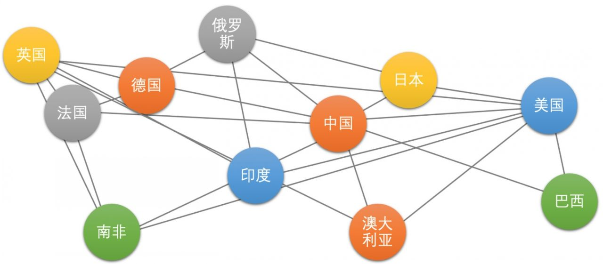
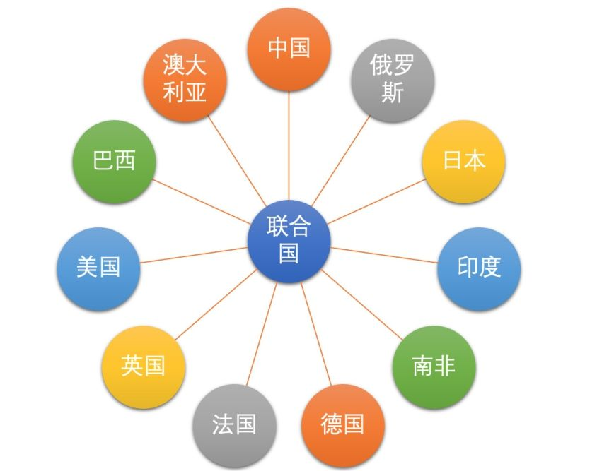
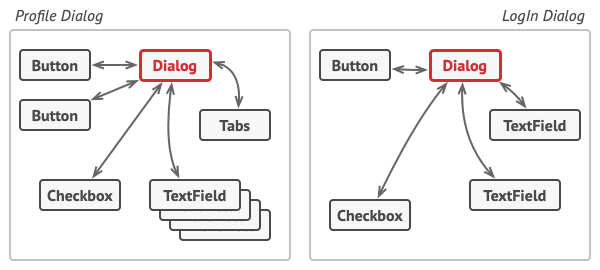

# 设计模式

宁贯一

---

## 行为型模式

---

### 责任链模式 (Chain of Responsibility) 1

使多个对象都有机会处理请求，从而避免请求的发送者和接收者之间的耦合关系。
将这个对象连成一条链，并沿着这条链传递该请求，直到有一个对象处理它为止。

---

### 责任链模式 (Chain of Responsibility) 2

- 场景
  - 加薪申请
- 优点
  - 随时地增加或修改处理一个请求的结构。增强了给对象指派职责的灵活性
- 缺点
  - 一个请求极有可能到了链的末端都得不到处理，或者因为没有正确配置而得不到处理

### 命令模式（Command）

这其实就是'行为请求者'与'行为实现者'的紧耦合
对请求排队或记录请求日志，以及支持可撤销的操作。

- 场景
  - 烧烤摊 vs 烧烤店（点菜员）
- 优点
  - 类间解耦
  - 扩展性好
- 缺点
  - 类爆炸
- 综合应用
  - 责任链模式：命令族(责任链)解析
  - 模板方法模式：

---

### 中介者模式（Mediator）

中介者模式又叫作调停者模式。其实就是中间人或者调停者的意思。

引入中介者来降低模块之间的耦合度，从而提高系统的可维护性和灵活性。

---

---

---

---

- 场景
  - 多人聊天室
- 优点
  - 降低了系统的耦合度
  - 容易扩展新的模块
  - 便于维护与复用
- 缺点
  - 中介者对象本身可能会变得比较复杂
  - 增加通信的成本
